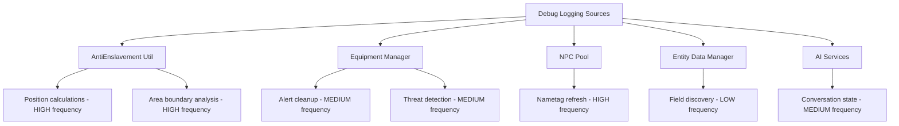
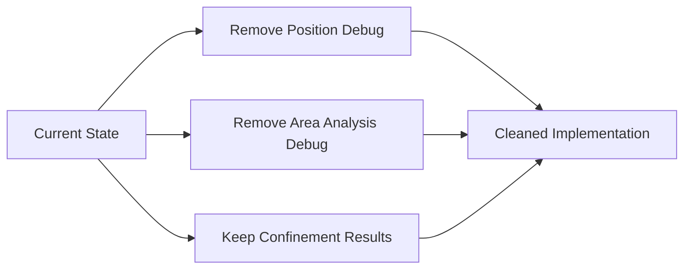
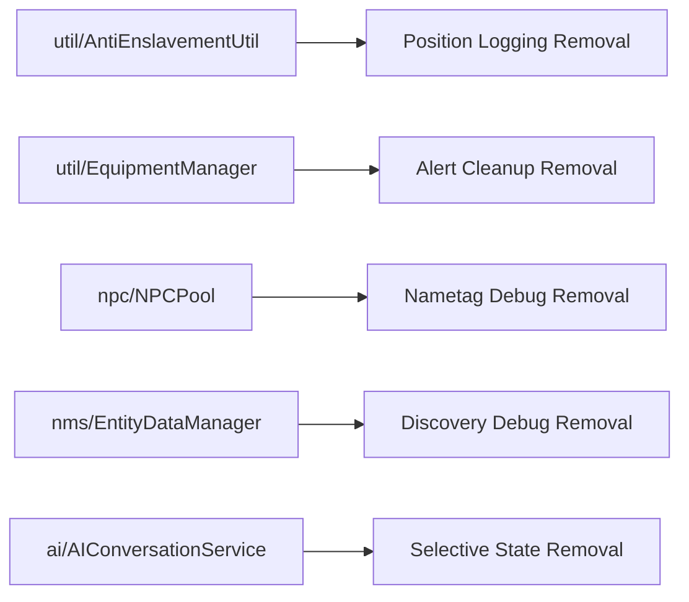

# Debug Log Cleanup Design

## 1. Overview

This design outlines the cleanup of unnecessary debug logging in the RealisticVillagers Minecraft plugin to improve performance and reduce log noise while preserving essential logging for critical systems like the reputation system.

**Target**: Remove excessive debug/fine level logging that provides minimal operational value while maintaining essential error and info logging.

## 2. Current Logging Analysis

### 2.1 Debug Logging Categories Identified

| Category | Examples | Assessment |
|----------|----------|------------|
| **AntiEnslavement Verbose Position Tracking** | Position analysis, walkable area calculations | High frequency, minimal operational value |
| **NPC Pool Nametag Refresh** | Status change tracking every refresh | Excessive frequency for routine operations |
| **AI Conversation Debug** | Tool call responses, conversation state changes | Some utility for AI debugging |
| **Entity Data Discovery** | NMS field discovery, reflection operations | Useful during development, excessive in production |
| **Equipment Manager Alert Cleanup** | Threat detection details for every villager | High frequency, debugging-only value |

### 2.2 Logging Frequency Assessment

## 3. Cleanup Strategy

### 3.1 Retention Criteria

**Keep Essential Logging**:
- Error and warning messages for debugging failures
- Info messages for plugin lifecycle events
- Reputation system debugging (critical for data integrity)
- AI system errors and important state changes

**Remove Excessive Logging**:
- Verbose position/area calculations in AntiEnslavementUtil
- Frequent nametag refresh debugging in NPCPool
- Alert cleanup routine logging in EquipmentManager
- Entity data field discovery details
- Routine AI conversation state changes

### 3.2 Code Modification Areas

#### 3.2.1 AntiEnslavementUtil.java

**Modifications**:
- Remove position-by-position logging in `calculateWalkableArea()`
- Remove area boundary analysis debugging
- Keep confinement detection results (essential for feature operation)

#### 3.2.2 NPCPool.java
**Modifications**:
- Remove nametag refresh trigger logging in `shouldRefreshNametag()`
- Keep NPC addition logging (useful for tracking)

#### 3.2.3 EquipmentManager.java
**Modifications**:
- Remove routine alert cleanup logging
- Remove verbose threat detection debugging
- Keep critical error conditions

#### 3.2.4 EntityDataManager.java & SafeEntityDataAPI.java
**Modifications**:
- Remove field discovery debug messages
- Remove routine operation success logging
- Keep failure and error logging

### 3.3 Implementation Approach

#### Phase 1: High-Frequency Noise Reduction
1. **AntiEnslavementUtil Position Tracking**
   - Remove lines 187-189 (position logging)
   - Remove lines 195-217 (area analysis)
   - Keep line 105 (confinement result)

2. **NPCPool Nametag Debugging**
   - Remove lines 195-197 (nametag refresh logging)
   - Keep NPC registration logging

#### Phase 2: Medium-Frequency Cleanup
1. **EquipmentManager Alert System**
   - Remove routine cleanup logging
   - Remove verbose threat detection details
   - Keep alert initialization and error logging

2. **Entity Data Operations**
   - Remove field discovery messages
   - Remove success confirmations for routine operations

#### Phase 3: AI System Selective Cleanup
1. **Conversation Service**
   - Keep error logging for debugging failures
   - Remove routine state change logging
   - Keep tool call failure messages

## 4. Affected Components

### 4.1 Core Module Components

### 4.2 Configuration Impact
- No configuration changes required
- Existing log level settings remain functional
- `Level.FINE` checks remain for performance in retained logging

## 5. Testing Strategy

### 5.1 Verification Approach
1. **Log Volume Measurement**
   - Before: Measure log output during typical gameplay
   - After: Verify significant reduction in debug noise

2. **Functionality Verification**
   - Anti-enslavement detection still works correctly
   - Reputation system logging remains intact
   - Error conditions still properly logged

3. **Performance Impact**
   - Verify reduced logging overhead
   - Confirm string formatting reduction improves performance

### 5.2 Rollback Plan
- Maintain removed logging code in comments for 1 release cycle
- Enable quick restoration if debugging needs arise

## 6. Expected Benefits

### 6.1 Performance Improvements
- **Reduced String Operations**: Elimination of frequent `String.format()` calls
- **Lower I/O Overhead**: Significantly less log file writing
- **Memory Efficiency**: Reduced temporary string object creation

### 6.2 Operational Benefits
- **Cleaner Log Files**: Easier identification of actual issues
- **Reduced Storage**: Lower log file sizes
- **Better Signal-to-Noise**: Important messages more visible

### 6.3 Quantified Impact
| Metric | Current | Target | Improvement |
|--------|---------|--------|-------------|
| Debug Messages/Minute | ~200-500 | ~20-50 | 75-90% reduction |
| Log File Growth | High | Low | 60-80% reduction |
| String Formatting Calls | Frequent | Minimal | 80%+ reduction |

## 7. Implementation Priority

### 7.1 High Priority (Immediate)
1. AntiEnslavementUtil position logging cleanup
2. NPCPool nametag refresh debugging removal
3. EquipmentManager alert cleanup logging removal

### 7.2 Medium Priority (Next Release)
1. EntityDataManager field discovery cleanup
2. AI conversation state selective cleanup
3. SafeEntityDataAPI routine operation logging

### 7.3 Low Priority (Future)
1. Review remaining fine-level logging across codebase
2. Establish logging standards for future development
3. Consider debug mode toggle for development builds