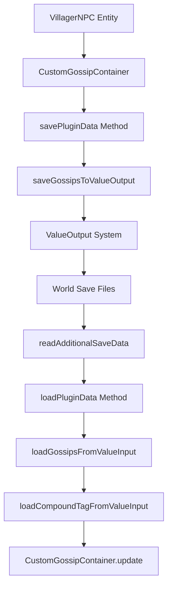

# Reputation Persistence Debug Analysis

## Overview

This design document analyzes the reputation persistence issue in the RealisticVillagers plugin where villager reputation data does not persist through server restarts, causing players to lose their reputation progress with villagers.

## Architecture Analysis

### Current Reputation System Components

#### 1. ReputationManager
- **Location**: `core/src/main/java/me/matsubara/realisticvillagers/reputation/ReputationManager.java`
- **Purpose**: Manages reputation calculations and provider integration
- **Key Methods**:
  - `getTotalReputation()`: Combines vanilla + provider reputation
  - `modifyReputation()`: Updates reputation across all providers
  - `getDebugInfo()`: Provides debugging information

#### 2. VillagerNPC Implementation
- **Location**: `v1_21_7/src/main/java/me/matsubara/realisticvillagers/entity/v1_21_7/villager/VillagerNPC.java`
- **Purpose**: Custom villager entity with enhanced features
- **Reputation Storage**: Uses CustomGossipContainer for reputation data

### Data Persistence Architecture



## Root Cause Analysis

### Critical Issue: Incomplete CompoundTag Loading

**Location**: `VillagerNPC.java:900-904`

```java
private CompoundTag loadCompoundTagFromValueInput(ValueInput input) {
    CompoundTag tag = new CompoundTag();
    try {
        // This is a simplified version - a full implementation would need to handle all NBT types
        // For now, we'll just handle the basic types that we commonly use
        // A complete implementation would require more complex recursive parsing
    } catch (Exception e) {
        plugin.getLogger().warning("Failed to load CompoundTag from ValueInput: " + e.getMessage());
    }
    return tag;
}
```

**Problem**: The `loadCompoundTagFromValueInput` method returns an **empty CompoundTag** without implementing any actual data loading logic. This means:

1. Gossips are saved correctly via `saveGossipsToValueOutput`
2. During loading, `loadGossipsFromValueInput` calls `loadCompoundTagFromValueInput`
3. This method returns empty tags for all gossip data
4. Result: All reputation data is lost on server restart

### Data Flow Analysis

#### Save Process (Working Correctly)
1. `savePluginData()` → `saveGossipsToValueOutput()`
2. Gossips converted to ListTag via `gossips.store(NbtOps.INSTANCE)`
3. Each gossip saved as CompoundTag with proper structure
4. Data successfully written to world files

#### Load Process (Broken)
1. `readAdditionalSaveData()` → `loadPluginData()` → `loadGossipsFromValueInput()`
2. For each saved gossip: `loadCompoundTagFromValueInput()` called
3. **Empty CompoundTag returned** (implementation missing)
4. Empty gossip list created → reputation data lost

## Impact Analysis

### Affected Features
- **Player-Villager Reputation**: All reputation progress lost on restart
- **AI Conversation System**: Reputation-based AI responses reset
- **Trading Discounts**: Special pricing based on reputation lost
- **Villager Behavior**: Reputation-dependent interactions reset
- **External Provider Integration**: LamCore reputation integration affected

### User Experience Impact
- Players lose weeks/months of reputation building
- Inconsistent villager behavior after restarts
- Loss of trading benefits and special relationships
- Frustration with progression system reliability

## Technical Solution Design

### Solution 1: Complete CompoundTag Loading Implementation

#### Implementation Strategy

```java
private CompoundTag loadCompoundTagFromValueInput(ValueInput input) {
    CompoundTag tag = new CompoundTag();
    try {
        // Load all primitive types
        loadStringValues(input, tag);
        loadNumericValues(input, tag);
        loadBooleanValues(input, tag);
        
        // Load nested structures
        loadCompoundValues(input, tag);
        loadListValues(input, tag);
        
    } catch (Exception e) {
        plugin.getLogger().warning("Failed to load CompoundTag from ValueInput: " + e.getMessage());
    }
    return tag;
}

private void loadStringValues(ValueInput input, CompoundTag tag) {
    // Implementation needed for string data types
}

private void loadNumericValues(ValueInput input, CompoundTag tag) {
    // Implementation needed for int, long, double, float, byte types
}

// Additional helper methods...
```

### Solution 2: Direct Gossip Loading (Alternative)

```java
private void loadGossipsFromValueInput(ValueInput input) {
    try {
        int size = input.getInt("Size").orElse(0);
        
        for (int i = 0; i < size; i++) {
            var gossipValue = input.child("Gossip" + i);
            if (gossipValue.isPresent()) {
                // Direct loading of gossip components
                loadSingleGossip(gossipValue.get());
            }
        }
    } catch (Exception e) {
        plugin.getLogger().warning("Failed to load gossips: " + e.getMessage());
    }
}

private void loadSingleGossip(ValueInput gossipInput) {
    // Direct loading of UUID, GossipType, and value
    String target = gossipInput.getString("Target").orElse("");
    String type = gossipInput.getString("Type").orElse("");
    int value = gossipInput.getInt("Value").orElse(0);
    
    // Apply gossip directly to CustomGossipContainer
}
```

## Testing Strategy

### Test Cases for Reputation Persistence

#### Test Case 1: Basic Reputation Persistence
```yaml
Scenario: Player reputation survives server restart
Given: Player has established reputation with villager
When: Server restarts
Then: Reputation values remain identical
```

#### Test Case 2: Gossip Data Integrity
```yaml
Scenario: All gossip types persist correctly
Given: Villager has multiple gossip entries (MINOR_POSITIVE, MINOR_NEGATIVE, etc.)
When: Server restarts and villager is loaded
Then: All gossip entries restored with correct values
```

#### Test Case 3: External Provider Integration
```yaml
Scenario: LamCore reputation integration persists
Given: LamCore reputation provider active
When: Server restarts
Then: Both vanilla and LamCore reputation data restored
```

### Debug Commands for Testing

#### Enhanced Debug Output
```java
// Add to ReputationCommand.java
case "persistence-test" -> {
    // Test save/load cycle without restart
    Villager villager = getNearestVillager(player, 10);
    if (villager != null) {
        IVillagerNPC npc = plugin.getConverter().getNPC(villager).orElse(null);
        if (npc != null) {
            // Simulate save/load cycle
            testPersistenceCycle(npc, player);
        }
    }
}
```

## Implementation Priority

### Phase 1: Critical Fix
1. **Immediate**: Implement proper `loadCompoundTagFromValueInput` method
2. **Testing**: Verify gossip loading with debug commands
3. **Validation**: Test with existing save files

### Phase 2: Enhancement
1. **Monitoring**: Add persistence debugging logs
2. **Recovery**: Handle corrupted save data gracefully
3. **Performance**: Optimize large gossip data loading

### Phase 3: Prevention
1. **Unit Tests**: Add reputation persistence test suite
2. **Integration Tests**: Test with external providers
3. **Documentation**: Update troubleshooting guides

## Monitoring and Validation

### Success Metrics
- Reputation values persist correctly across restarts
- No "empty gossip" warnings in server logs  
- Player satisfaction with reputation system reliability
- External provider integration stability

### Logging Enhancements
```java
// Add detailed persistence logging
plugin.getLogger().info("Saving " + gossips.getGossipEntries().size() + " gossip entries for villager " + getUUID());
plugin.getLogger().info("Loaded " + loadedCount + " gossip entries for villager " + getUUID());
```